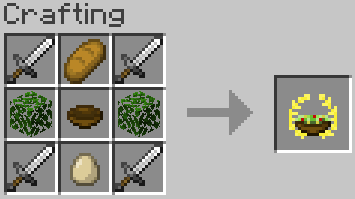

# "Caesar" Salad
Adds a very peculiar salad to the game.

Installing

<ul>
<li>Place the resourcepack file in your resourcepacks folder</li>
<li>Place the datapack file in your world's datapacks folder</li>
</ul>

Crafting

<i>Leaves can be of any type</i>

Uninstalling

<ol>
<li>To remove traces of the pack, run <code>/function jmnotcaesarsalad:uninstall</code></li>
<li>Then you can safely remove the file from the datapacks folder.</li>
</ol>

## Links
[Modrinth](https://modrinth.com/datapack/joshs-more-foods)
 
[Planet Minecraft](https://www.planetminecraft.com/data-pack/josh-s-more-foods-20-new-recipes/)